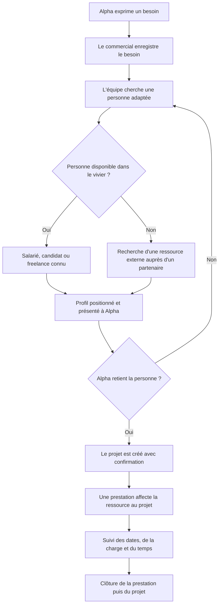

# Ava Manager — le parcours métier, simplement

**Objet de ce document :** comprendre ce que fait Ava Manager avant de parler d'écrans, de base de données ou de développement. Exemple fictif : la société **Alpha** cherche une personne pour une mission informatique.

## Le schéma

**En une phrase :** on part d'une demande du client, on trouve et propose une personne, puis on organise et suit sa mission si le client l'accepte.

## Ce qui se passe à chaque étape

| Étape | Qui agit ? | Ce qu'il fait dans Ava Manager | Ce qui existe après |
|---|---|---|---|
| 1. Société et contact | Commercial | Il ouvre la fiche **Alpha** et, s'il est connu, celle d'**Alice**, son interlocutrice. | Une société ; éventuellement un contact rattaché à elle. |
| 2. Besoin | Commercial | Il décrit la demande : compétences, période, nombre de personnes et informations commerciales connues. | Un **besoin** ouvert. Il peut être créé sans contact ; la société est obligatoire. |
| 3. Recherche | Recrutement et staffing | Ils consultent les ressources et candidats connus. Si nécessaire, ils cherchent aussi une personne externe. | Des profils envisageables. Le besoin n'est pas encore un projet. |
| 4. Positionnement | Équipe habilitée | Elle rattache **une personne** au besoin et suit sa présentation : CV, entretien, qualification, tarif proposé, retour du client selon le cas. | Un **positionnement** : la trace de « cette personne est proposée pour ce besoin ». Plusieurs personnes peuvent être proposées. |
| 5. Décision du client | Commercial | Il enregistre si Alpha retient ou refuse le profil. En cas de refus, la recherche peut continuer. | Une décision traçable ; aucun projet n'apparaît automatiquement. |
| 6. Projet | Responsable habilité | Quand l'affaire se concrétise, il confirme les informations nécessaires et **crée explicitement** le projet. | Un **projet** lié au besoin. Un besoin peut mener à plusieurs projets. |
| 7. Prestation | Staffing ou directeur de projet habilité | Il choisit le projet et la **ressource** qui va travailler, puis renseigne dates, charge et conditions économiques de sa mission. | Une **prestation** : l'affectation concrète d'une ressource à un projet. |
| 8. Suivi et clôture | Ressource et responsable de projet | La ressource saisit son temps ; l'équipe suit charge, absences et résultats, puis clôture la prestation et le projet. | Un historique de mission conservé. |

## Les mots à ne pas confondre

- **Société** : l'entreprise cliente, Alpha dans l'exemple.
- **Contact** : une personne chez Alpha, comme Alice. Elle est utile, mais n'est pas obligatoire pour enregistrer le besoin. Si le besoin n'a pas de contact, il faut en renseigner un au moment de créer le projet depuis ce besoin.
- **Besoin** : ce qu'Alpha demande. Il peut viser plusieurs postes.
- **Vivier** : les personnes déjà connues du cabinet : candidats, salariés et freelances. Une recherche externe peut compléter ce vivier.
- **Positionnement** : la proposition d'une personne précise sur un besoin précis. Ce n'est ni le projet ni la mission.
- **Projet** : le dossier d'exécution avec le client. Il est créé par une décision explicite, après confirmation de ses paramètres.
- **Prestation** : la mission d'une ressource sur un projet, avec ses propres dates, sa charge et ses conditions. Un projet peut avoir plusieurs prestations.

Un **candidat** peut être proposé au client. Avant de lui attribuer une prestation ou de lui faire saisir du temps, l'équipe RH doit activer son profil **ressource**. Son identité et son historique candidat sont conservés.

## Et les « Actions » ?

Dans Ava Manager, une **Action** est un travail à faire ou à suivre, par exemple « appeler Alice », « envoyer le CV » ou « relancer Alpha vendredi ». Elle est attachée à **une fiche précise** : société, contact, candidat, ressource, besoin ou projet. Elle aide l'équipe à ne pas perdre le fil ; elle ne crée pas, à elle seule, un projet ou une prestation.

L'**historique métier** garde la trace des décisions et changements importants : qui a créé le besoin, quel profil a été proposé, quel retour le client a donné, qui a confirmé le projet et comment la prestation a évolué.

## Deux précisions sur le périmètre

**Chercher auprès d'un partenaire** permet de trouver une ressource externe pour répondre au besoin. Cela ne signifie pas que le premier lot d'Ava Manager gère déjà tout le processus d'achats et de factures fournisseurs ; ce module est différé.

**Présenter une personne et des conditions commerciales** fait partie du parcours. Un module complet de devis ou de facture client n'est pas requis pour comprendre ce parcours et n'est pas dans le premier lot retenu.

Ce document est une explication pédagogique. Pour les règles détaillées et les cas particuliers, voir le [cadrage métier réconcilié](CADRAGE_METIER_RECONCILIE_2026-09-16.md) et les [décisions DEC-01 à DEC-18](BRIEF_BRAIN_2026-09-16.md).
